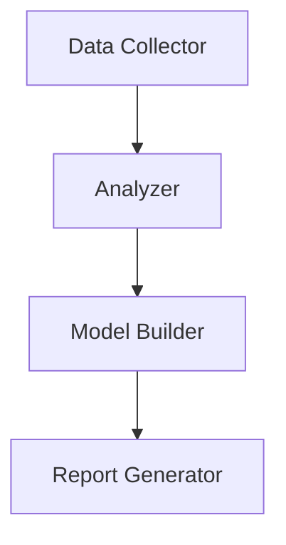

# MXLLM Research Framework

[](https://opensource.org/licenses/MIT)

## Project Overview
A multi-agent system for advanced materials research, featuring:
- Automated data collection from academic databases
- Intelligent literature analysis using LLMs
- Collaborative agent workflow for research automation

## Core Features


## Quick Start
```bash
pip install -r requirements.txt
python app/main.py
```

## License
Licensed under [MIT License](LICENSE)  
Copyright © 2024 Yicheng Ma